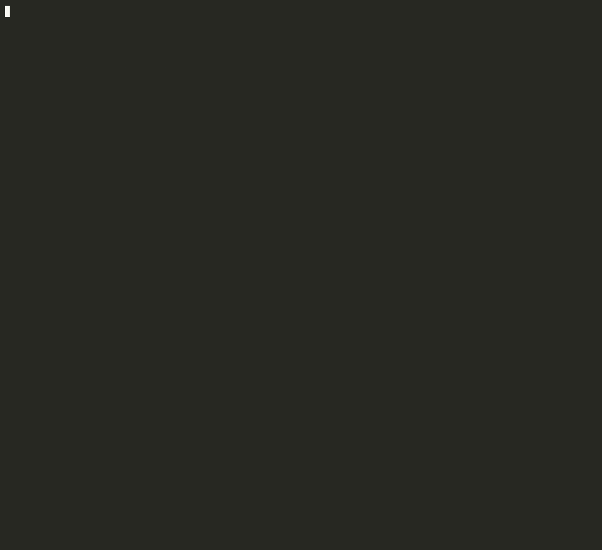

<div align="center">

```
 ██████╗██╗  ██╗███████╗███████╗███████╗
██╔════╝██║  ██║██╔════╝██╔════╝██╔════╝
██║     ███████║█████╗  ███████╗███████╗
██║     ██╔══██║██╔══╝  ╚════██║╚════██║
╚██████╗██║  ██║███████╗███████║███████║
 ╚═════╝╚═╝  ╚═╝╚══════╝╚══════╝╚══════╝
```

**A fully-featured, rules-complete chess game that runs in your terminal.**


</div>

---

## Demo

<div align="center">
  
</div>

> Scholar's Mate: **1. e4 e5 2. Bc4 Nc6 3. Qh5 Nf6?? 4. Qxf7#**

---

## Features

### Gameplay

| Feature | Description |
|---|---|
| ♔ ♕ ♖ ♗ ♘ ♙ | Full Unicode piece set, ANSI-colored per team |
| ↕ Board flip | Board automatically flips between turns so each player always sees their pieces at the bottom |
| ✅ Full move validation | Pseudo-legal generation + self-check filtering — no illegal moves possible |
| ♟ En passant | Correctly tracks the en passant target square across all positions |
| ♜ Castling | Both kingside and queenside; rights revoked on king/rook move or rook capture |
| ♛ Promotion | Choose your promotion piece: **Queen, Rook, Bishop, or Knight** |
| 🔴 Check banner | ASCII art CHECK banner renders immediately when a king is in check |
| 💀 Checkmate banner | Full-width CHECKMATE art fires on game end |

### Draw Conditions

| Condition | Rule |
|---|---|
| Stalemate | No legal moves, not in check |
| 50-move rule | 50 full moves with no capture or pawn advance |
| Threefold repetition | Same position (board + active color + castling rights + en passant) occurs 3 times |
| Insufficient material | K vs K · K+B vs K · K+N vs K · K+B vs K+B (same square color) |

### Input & UX

- Row/column numeric input — no algebraic notation required
- Out-of-bounds and bad-input rejection with clear error messages
- Can't accidentally select an empty square or the opponent's piece
- Promotion prompt only fires when a pawn actually reaches the back rank

---

## Getting Started

### Requirements

- C++20 compiler (clang++ 14+ or g++ 12+)
- CMake 3.20+
- Ninja (or Make)

### Build

```bash
git clone <repo-url>
cd Chess
cmake -B build -G Ninja
cmake --build build
```

### Play

```bash
./build/main
```

### Run Tests

```bash
./build/chess_test
```

All **340 tests** across 20 sections should pass.

---

## How to Play

The board is displayed from your perspective — your pieces are always at the bottom.

```
     1   2   3   4   5   6   7   8
   ┌───┬───┬───┬───┬───┬───┬───┬───┐
 8 │ ♜ │   │ ♝ │ ♛ │ ♚ │ ♝ │ ♞ │ ♜ │
   ├───┼───┼───┼───┼───┼───┼───┼───┤
 7 │ ♟ │ ♟ │ ♟ │ ♟ │   │ ♟ │ ♟ │ ♟ │
   ├───┼───┼───┼───┼───┼───┼───┼───┤
   ...
```

**Each turn:**

1. You are prompted: `SELECT PIECE TO MOVE`
2. Enter the **Row** (1–8) and **Col** (1–8) of the piece to move
3. You are prompted: `SELECT SQUARE TO MOVE TO`
4. Enter the **Row** and **Col** of the destination

**Special moves:**

| Move | How |
|---|---|
| Castling | Move the king two squares toward the rook |
| En passant | Move the pawn diagonally to the vacated square immediately after the opponent's double pawn push |
| Promotion | Move a pawn to the back rank — you'll be asked to choose a piece |

**Coordinate system** (both white and black views use the same labels):
- Rows are labeled 1–8 from the **bottom** of the screen
- Columns are labeled 1–8 from **left to right**

---

## Rules Implemented

```
  Piece movement       ✔   All 6 piece types with full movement rules
  Captures             ✔   Standard + en passant
  Castling             ✔   Kingside & queenside (4 independent rights)
  En passant           ✔   Target square tracked across turns
  Promotion            ✔   Q / R / B / N choice
  Check detection      ✔   Ray-based + knight/pawn attack tables
  Checkmate            ✔   No legal moves + in check
  Stalemate            ✔   No legal moves + not in check
  50-move rule         ✔   Halfmove clock tracked per move
  Threefold repetition ✔   Position hash stored in move history
  Insufficient material✔   Four dead-draw material configurations
  Pinned pieces        ✔   Move rejected if it exposes own king
  Cannot castle        ✔   Through check, out of check, or into check
```

---

## Architecture

The codebase is structured in clean, separated layers:

```
chess_engine.h   ── Pure game logic. Zero I/O.
                    Board, GameState, Piece, CastlingRights
                    try_move()         — validates + applies a move
                    is_in_check()      — ray-based attack detection
                    has_legal_moves()  — checkmate/stalemate oracle
                    make_initial_state()

display.h        ── Terminal rendering only.
                    print_board()      — ANSI colors, Unicode pieces, row/col labels
                    print_check()      — ASCII art CHECK banner
                    print_checkmate()  — ASCII art CHECKMATE banner

input.h          ── User input only.
                    get_user_move()    — prompts, validates, returns board coords
                    user_row_to_board()
                    user_col_to_board()

main.cpp         ── Game loop: render → input → engine → repeat

test.cpp         ── 340 automated tests across 20 sections
```

### Coordinate System

All internal logic uses **absolute board coordinates**:

```
Row 0  =  black back rank  (♜ ♞ ♝ ♛ ♚ ♝ ♞ ♜)
Row 7  =  white back rank  (♖ ♘ ♗ ♕ ♔ ♗ ♘ ♖)
```

The display layer handles orientation: when it's black's turn, the board is rendered upside-down so black's pieces appear at the bottom. Input coordinates are remapped accordingly. The engine itself never flips.

### Move Validation Flow

```
try_move(gs, r1, c1, r2, c2)
  │
  ├─ is_pseudo_legal()     checks piece movement rules + castling + en passant
  │
  ├─ apply_pseudo_move()   applies move on a copy of the board
  │
  ├─ is_in_check(copy, color)   rejects move if it leaves own king in check
  │
  ├─ update_castling_rights()
  ├─ update_ep_square()
  ├─ update_halfmove_clock()
  ├─ push_position_hash()
  │
  ├─ has_legal_moves(opponent)  → is_checkmate or is_stalemate
  │
  └─ check draw conditions      → 50-move, threefold, insufficient material
```

---

## File Structure

```
Chess/
├── chess_engine.h          Core game logic (no I/O)
├── display.h               ANSI terminal rendering
├── input.h                 User input handling
├── main.cpp                Game entry point and loop
├── test.cpp                340-test automated test suite
├── CMakeLists.txt          CMake build configuration
├── ANSI Windows Terminal.h Windows UTF-8/ANSI shim
├── demo.gif                Terminal demo (Scholar's Mate)
├── demo.cast               Raw asciinema recording
└── demo_player.py          PTY-based demo driver
```

---

## Test Coverage

The test suite covers every major subsystem:

| Section | Tests |
|---|---|
| Board initialization | Piece placement, colors, counts |
| `can_attack` — all pieces | Rays, jumps, blocked paths, edges |
| `is_in_check` | Every attack vector |
| Pawn moves | Push, double push, capture, en passant, promotion |
| Rook, Bishop, Knight, Queen, King | Legal/illegal moves, blocking, edge cases |
| Castling | 8+ scenarios including rights revocation |
| En passant | Setup, capture, self-check prevention |
| Check detection | Every piece type + discovered check |
| Checkmate | 4 mating positions + false-positive tests |
| Stalemate | Corner and edge positions |
| 50-move rule | Clock increment, reset, trigger |
| Threefold repetition | Hash equality, near-misses |
| Insufficient material | All 4 dead-draw configurations |
| Illegal moves | Pinned pieces, moving into check |
| Adversarial | 11 edge cases designed to break the engine |

---

<div align="center">

*Built with C++20. Tested with 340 automated tests. Every chess rule included.*

</div>
